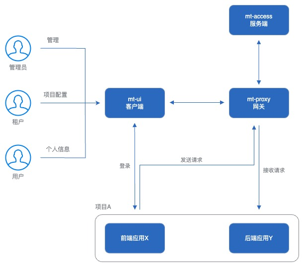

    多树AUTH / MT-AUTH

  <strong>用户，应用，API管理中心</strong>

  MT-AUTH是一款基于Spring Boot, OAuth2与事件驱动的角色的权限管理(RBAC)系统，通过集成Spring Cloud Gateway实现了API鉴权，缓存，跨域，CSRF防护，特殊字符过滤等常用功能

    

# 应用场景
如果您有多个以下列举需求，那么mt-auth会是一个不错的选择
## 企业
- 旗下有多个项目
- 项目之间用户通用，需要能够统一管理用户
- 项目由不同的团队管理，团队相对独立
- 用户在不同项目中有不同的权限
- 管理应用与API
- 项目之间需要共享API
# 项目特点
- 基于事件的系统架构
- 应用，API与用户管理  
- JWT不对称钥匙
- 支持OAuth2 
- 支持websocket
- 密码重置, 注册码注册用户
- 已签发JWT回收
- 异步日志
- API层面缓存，跨域，CSRF防护，GZip，隐藏系统错误返回信息等
- 请求日志记录
# 项目示意图

# 技术栈
| 模块                       | 概述                                  | 技术栈                                  |  
|:---------------------------|:--------------------------------------|:--------------------------------------|
| mt-access      | 用户, 应用与API管理, 注册中心, 通知 |Spring Boot, JWT, OAuth2, Redis, RabbitMQ, Spring Cloud Eureka
| mt-proxy        | API网关   |Spring Boot, Spring Cloud Gateway, Redis, RabbitMQ
| mt-ui | 管理前端UI |Angular
| mt-common | 通用Utility  |Spring Boot
| mt-integration-test | 集成测试 |Spring Boot Test
# 演示项目
- [NodeJs](./mt-sample/nodejs)
- [Spring Boot](./mt-sample/spring-boot/)